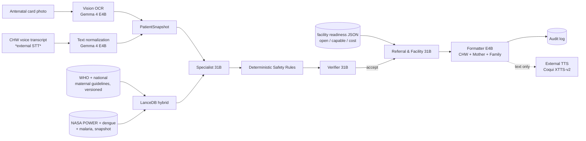

# MAITRI-Gemma — Architecture Flowchart (v2)

Two views of the same system. v2 fixes: deterministic safety rules visible as a first-class node, Referral & Facility Agent added as the real seventh agent, "nearest maternal-care-capable facility" replaces "nearest clinic", immediate safe escalation replaces "clinician within 24h", STT/TTS labelled external, verifier reject loop visually emphasized.

---

## A. Mermaid — full system flow (v2)

```mermaid
flowchart TD
    %% --- Inputs
    CHW([Community Health Worker<br/>Android PWA, offline-first]):::user
    CHW -->|photo + voice transcript* + GPS| API[FastAPI Edge<br/>auth, rate limit, PII strip]:::infra
    API --> ORCH{{Orchestrator<br/>LangGraph FSM<br/>deterministic — no Gemma}}:::orch

    %% --- Intake
    ORCH -->|new session| INTAKE[1. Intake Agent<br/>Gemma 4 E4B<br/>photo/form + text + transcript]:::agent
    INTAKE -->|PatientSnapshot| GATE1{completeness<br/>&ge; 0.7?}:::gate
    GATE1 -- no --> CLARIFY[Ask CHW for missing fields<br/>Gemma 4 E4B in local lang]:::agent
    CLARIFY --> INTAKE
    GATE1 -- yes --> RETRIEVE[2. Retrieval Agent<br/>LanceDB hybrid<br/>WHO + national + climate snapshot]:::agent

    %% --- Retrieval
    RETRIEVE -->|EvidencePack| GATE2{retrieval<br/>conf &ge; 0.6?}:::gate
    GATE2 -- no, attempt &lt; 3 --> REWRITE[Query rewriter<br/>Gemma 4 31B]:::agent
    REWRITE --> RETRIEVE
    GATE2 -- no, attempt = 3 --> ESCALATE_NOW[IMMEDIATE SAFE ESCALATION<br/>+ default referral packet<br/>+ parallel clinician review]:::escalate
    GATE2 -- yes --> SPECIALIST[3. Risk Specialist<br/>Gemma 4 31B + thinking<br/>function calling]:::agent

    %% --- Specialist + tools
    SPECIALIST -->|tool calls| TOOLS[(Tools:<br/>drug-in-pregnancy lookup,<br/>climate risk,<br/>gestational age compute,<br/>referral packet builder)]:::tool
    TOOLS --> SPECIALIST
    SPECIALIST -->|RiskAssessment| SAFETY[**4. Deterministic Safety Rules**<br/>BP &ge; 160/110 -> Red,<br/>seizure / severe HA / bleeding -> Red,<br/>**tier may only move UPWARD**]:::safety
    SAFETY --> VERIFY

    %% --- Verification — the hero loop
    VERIFY[**5. Verifier Agent**<br/>Gemma 4 31B<br/>independent prompt<br/>**claim &harr; evidence NLI**]:::hero
    VERIFY --> GATE3{accepted?}:::gate
    GATE3 -- **REJECT**, loop &lt; 2 --> OPT_REWRITE[**6. Optimizer Agent**<br/>diagnoses why output failed<br/>rewrites Specialist prompt<br/>injects counter-evidence]:::hero
    OPT_REWRITE --> SPECIALIST
    GATE3 -- reject, loop = 2 --> ESCALATE_NOW
    GATE3 -- accept --> REFERRAL[**7. Referral & Facility Agent**<br/>Gemma 4 31B + function calls<br/>open NOW · maternal-emergency capable<br/>distance · cost · ambulance phone<br/>voucher eligibility — JSY / JKN]:::agent

    %% --- Output
    REFERRAL --> FORMAT[Formatter Agent<br/>Gemma 4 E4B<br/>3 outputs: CHW + Mother + Family<br/>text only — TTS is external*]:::agent
    FORMAT --> BACKTR{back-translation<br/>equivalent?}:::gate
    BACKTR -- no --> FORMAT
    BACKTR -- yes --> AUDIT[(Audit log<br/>SQLite append-only<br/>WORM S3 archive in prod<br/>EU AI Act Art. 12 discipline)]:::infra
    AUDIT --> DELIVER[Safe Delivery:<br/>CHW card + mother+family explanation<br/>+ facility-aware referral packet]:::deliver
    DELIVER --> CHW

    %% --- Refusal path
    API -. unsafe request .-> REFUSE[Refuse with structured reason<br/>log to audit, do not call Specialist]:::escalate

    %% --- Footer note: every escalation still produces a default referral
    ESCALATE_NOW --> REFERRAL

    %% --- Feedback loops back to ops (post-hackathon)
    AUDIT -. tier drift, fn-Red rate .-> EVAL[(Offline eval set<br/>+ DSPy prompt opt<br/>shadow A/B)]:::loop
    EVAL -. promote prompts .-> SPECIALIST
    EVAL -. promote prompts .-> RETRIEVE

    classDef user fill:#fef3c7,stroke:#b45309,color:#7c2d12,stroke-width:2px
    classDef agent fill:#e0e7ff,stroke:#4338ca,color:#1e1b4b,stroke-width:2px
    classDef infra fill:#f3f4f6,stroke:#374151,color:#111827
    classDef gate fill:#fff,stroke:#0ea5e9,color:#0c4a6e,stroke-width:2px,stroke-dasharray:4 2
    classDef tool fill:#ecfeff,stroke:#0891b2,color:#155e75
    classDef escalate fill:#fee2e2,stroke:#b91c1c,color:#7f1d1d,stroke-width:3px
    classDef deliver fill:#dcfce7,stroke:#15803d,color:#14532d,stroke-width:2px
    classDef orch fill:#fde68a,stroke:#92400e,color:#78350f,stroke-width:2px
    classDef loop fill:#fdf4ff,stroke:#a21caf,color:#581c87,stroke-dasharray:5 3
    classDef safety fill:#fff7ed,stroke:#9a3412,color:#7c2d12,stroke-width:3px
    classDef hero fill:#f5d0fe,stroke:#a21caf,color:#581c87,stroke-width:3px
```



\* STT (audio → text) and TTS (text → audio) are external pipeline components. Gemma 4 owns multimodal understanding, reasoning, verification, tool use, and language generation.

### How to read this v2 flowchart

The bold-orange node (Deterministic Safety Rules) is now visible — it sits between the Specialist and the Verifier and can only promote a tier upward, never down. The bold-purple Verifier and Optimizer pair are the system's hero loop — when the Verifier rejects an unsupported claim ("proteinuria detected" not in evidence), the Optimizer rewrites the Specialist prompt with counter-evidence and the Specialist re-runs. The red **IMMEDIATE SAFE ESCALATION** node never blocks the Referral & Facility Agent from preparing a default-Red packet — clinician review fires in parallel. There is no 24-hour wait on the safety path.

---

## B. Excalidraw scene (v2)

The file `maitri_architecture.excalidraw` (in the same folder) is the v2 hand-drawn scene. Open at https://excalidraw.com → "Open" → load the file. Color encoding: orange for safety, purple for the hero verification loop, red for escalation paths, green for delivery.

```
CHW PWA → Edge (PII strip + offline queue) → Orchestrator (LangGraph)
                                                        ↓
                                            1. Intake Agent (E4B)
                                                photo / form / transcript
                                                        ↓
                                            2. Retrieval Agent
                                                WHO + national + climate
                                                        ↓
                                            3. Risk Specialist (31B + tools)
                                                        ↓
                                       ╔═════════════════════════════════════╗
                                       ║  4. DETERMINISTIC SAFETY RULES      ║
                                       ║     red flags promote tier UPWARD   ║
                                       ║     never downward                  ║
                                       ╚═════════════════════════════════════╝
                                                        ↓
                                       ╔═════════════════════════════════════╗
                                       ║  5. VERIFIER (31B, independent)     ║
                                       ║     claim ↔ evidence entailment     ║
                                       ╚═════════════════════════════════════╝
                                              ↓                       ↓
                                          REJECT (≤2)             ACCEPT
                                              ↓                       ↓
                                       6. OPTIMIZER          7. Referral & Facility Agent
                                       counter-evidence      open NOW · capable · cost · ambulance
                                       prompt rewrite                ↓
                                              ↓                  Formatter
                                          back to               CHW + Mother + Family
                                          Specialist                 ↓
                                                                Audit Log (WORM)
                                                                     ↓
                                                                Safe Delivery
                                                              referral packet + voice script

If verifier rejects twice OR safety rule promotes:
   IMMEDIATE SAFE ESCALATION + default referral packet + parallel clinician review
   (we do NOT make the CHW wait 24h)
```

---

## C. Sequence diagram — single hero case (v2)

```mermaid
sequenceDiagram
    autonumber
    participant CHW as CHW (PWA, offline-capable)
    participant API as FastAPI Edge
    participant ORCH as Orchestrator
    participant IN as Intake (E4B)
    participant RET as Retrieval (LanceDB + Gemma)
    participant SP as Specialist (31B)
    participant SR as Safety Rules (deterministic)
    participant V as Verifier (31B, independent)
    participant OPT as Optimizer
    participant RF as Referral & Facility (31B + tools)
    participant FMT as Formatter (E4B)
    participant LOG as Audit (SQLite/WORM)

    CHW->>API: POST /case (photo, voice transcript, GPS=Saharsa, lang=hi)
    API->>ORCH: session created
    ORCH->>IN: extract PatientSnapshot
    IN-->>ORCH: snapshot (completeness 0.84, BP 142/94, week 32, headache, swollen feet)
    ORCH->>RET: query (snapshot + risk factors + heatwave_active)
    RET-->>ORCH: EvidencePack (conf 0.78, 5 chunks: WHO ANC 2025, RMNCH+A 2024)
    ORCH->>SP: triage with snapshot + evidence
    SP->>SP: thinking-mode reasoning
    SP-->>ORCH: RiskAssessment(tier=Amber, confidence=0.82, claim "proteinuria detected")
    ORCH->>SR: apply deterministic safety rules
    SR-->>ORCH: tier remains Amber (BP 142/94 below auto-Red threshold of 160/110)
    ORCH->>V: verify(assessment, evidence)
    V-->>ORCH: REJECT — "proteinuria detected" has NO supporting chunk
    ORCH->>OPT: rewrite Specialist prompt with counter-evidence
    OPT-->>ORCH: revised prompt: "remove unsupported claims; recompute citations"
    ORCH->>SP: re-run
    SP-->>ORCH: RiskAssessment(tier=Amber, confidence=0.88, rationale grounded in 3 cited chunks)
    ORCH->>SR: re-apply
    SR-->>ORCH: tier remains Amber
    ORCH->>V: verify
    V-->>ORCH: ACCEPT
    ORCH->>RF: build referral packet (gps, tier=Amber, time=14:32 IST)
    RF->>RF: function call lookup_facility_readiness, estimate_transport_cost, check_voucher_eligibility
    RF-->>ORCH: ReferralPacket(facility="Saharsa District Hospital", open_now=true, maternal_emergency=true, distance=14km, cost_level=public_low_cost, ambulance="+91-xxxx", voucher="JSY eligible")
    ORCH->>FMT: render CHW card + mother explanation + family explanation (Hindi)
    FMT-->>ORCH: deliverable (3 texts + referral PDF)
    ORCH->>LOG: append audit entry (every prompt, every chunk id, every tool call, model versions, prompt versions)
    ORCH-->>API: deliverable
    API-->>CHW: streamed result (CHW sees Amber chip first, mother+family scripts render, referral packet downloads)
```

This is the most important diagram for technical judges — the verification rejection-then-recovery loop is visible, the deterministic safety rules layer is visible, and the Referral & Facility Agent's tool calls are explicit. Walk through it line by line in the writeup.

---

## D. Data flow at a glance



---

## E. Notes for the video

The video uses **only the sequence diagram (Section C)** as the technical anchor — it is the part judges can read in 8 seconds and understand the verification rejection-then-recovery loop. The Mermaid full-system flowchart (Section A) is the README cover; the Excalidraw is the slide-deck cover image. Do not show all four diagrams — pick one per artifact.
