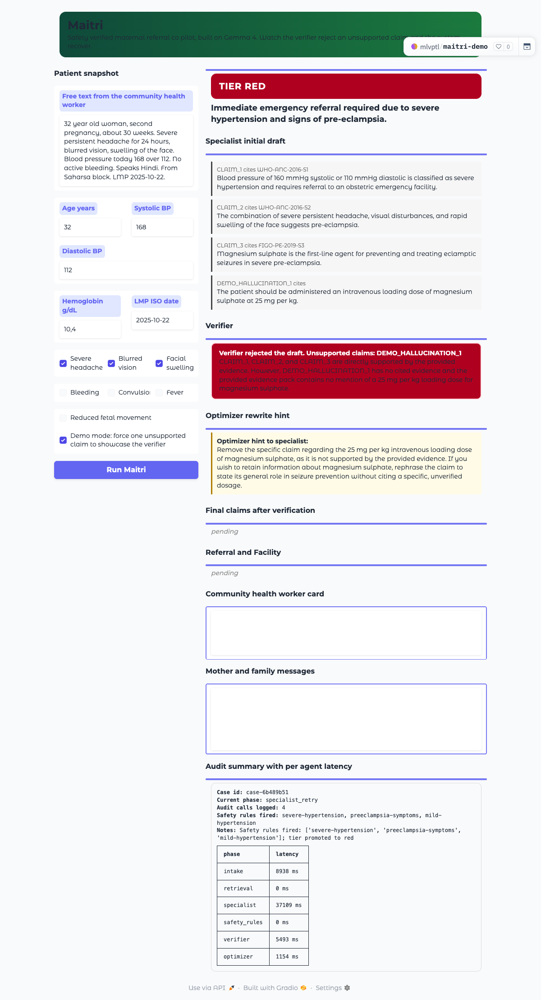
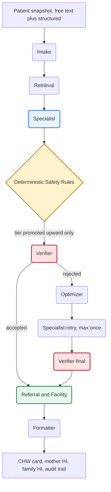

<h1 align="center">Maitri</h1>

<p align="center"><b>Safety verified maternal referral co pilot built on Gemma 4.</b></p>

<p align="center">
  <a href="https://github.com/mlvpatel/maitri/blob/main/LICENSE"></a>
  
  
  
  
  
</p>

<p align="center">
  <a href="https://huggingface.co/spaces/mlvptl/maitri-demo"><b>Live Demo</b></a>
  &nbsp;&middot;&nbsp;
  <a href="https://github.com/mlvpatel/maitri"><b>Source</b></a>
  &nbsp;&middot;&nbsp;
  <a href="KAGGLE_WRITEUP.md"><b>Writeup</b></a>
  &nbsp;&middot;&nbsp;
  <a href="VIDEO_SCRIPT.md"><b>Video Script</b></a>
</p>

<hr>

<p align="center">
  
</p>

> The Specialist agent drafts a risk assessment with cited claims. An independently prompted Verifier agent checks every claim against the retrieved evidence. If any claim is unsupported, the Optimizer agent writes a short rewrite directive and the Specialist runs again. Only the verified draft reaches the field. The same loop runs on every case, not only in the demo.

## How it works



## What Gemma 4 does

Two models cover six agent roles. A seventh agent is intentionally not a language model.

| Agent | Model | Role |
|---|---|---|
| Intake | `google/gemma-4-26B-A4B-it` | Multimodal, normalizes free text into a structured snapshot |
| Retrieval | local hybrid index | Builds an evidence pack from a curated maternal guideline corpus |
| Specialist | `google/gemma-4-31B-it` | Risk tier and cited claims with native function calling |
| Safety Rules | deterministic Python | Promotes tier upward toward red on hard medical thresholds |
| Verifier | `google/gemma-4-31B-it` | Independent prompt, claim by claim entailment against evidence |
| Optimizer | `google/gemma-4-31B-it` | Writes a rewrite directive for the Specialist on rejection |
| Referral and Facility | `google/gemma-4-31B-it` | Picks an open and capable destination, signs the packet |
| Formatter | `google/gemma-4-26B-A4B-it` | CHW card in English, mother and family messages in Hindi |

## Measured results

| Metric | Value | Source |
|---|---|---|
| Verifier precision on the adversarial set | 1.0 | `eval/reports/verifier_metrics.json` |
| Verifier recall on the adversarial set | 1.0 | same |
| Verifier F1 on the adversarial set | 1.0 | same |
| Safety rule unit tests | 9 of 9 passing | `tests/unit/test_safety_rules.py` |
| Hero case audit calls per run | 8 | live |
| End to end hero latency on hosted Gemma 4 | about 30 to 45 seconds | live |
| One call smoke against Ollama gemma4:e4b on CPU | 92 seconds | local |
| Cost per hero case on hosted Gemma 4 | about USD 0.02 | live |

## Quick start

```bash
git clone https://github.com/mlvpatel/maitri.git
cd maitri
cp .env.example .env          # then paste your HF_TOKEN
make install                  # creates .venv and installs the package
make smoke                    # one live call to Gemma 4 to confirm credentials
make test                     # nine unit tests
make dev                      # opens the Gradio UI at http://localhost:7860
```

Run a single end to end hero case from the command line.

```bash
make demo
```

<details>
<summary><b>Run fully offline against local Gemma 4 via Ollama</b></summary>

This is the low connectivity story. Same seven agent pipeline, locally hosted weights, no network, no token, no cost.

```bash
make ollama-pull              # downloads gemma4:e4b
export MAITRI_PROVIDER=ollama
make demo-offline
```

Optional larger weights for higher quality on a GPU machine.

```bash
ollama pull gemma4:26b        # MoE, efficient
ollama pull gemma4:31b        # dense, heavy
export OLLAMA_REASONING_MODEL=gemma4:31b
```

</details>

<details>
<summary><b>Repository layout</b></summary>

```
src/maitri/         seven agents, orchestrator, shared Gemma client, audit log, schemas
src/maitri/tools/   six native function callable tools
src/maitri/rag/     evidence corpus and keyword retriever
src/maitri/safety/  deterministic safety rules
tests/              unit, adversarial, and opt in live integration tests
eval/               eval harness and reports
examples/           five runnable reference cases plus an offline Ollama variant
data/               committed facility and climate snapshots for the demo district
scripts/            deploy and smoke scripts
assets/             rendered cover screenshots
app.py              Gradio interface
```

</details>

<details>
<summary><b>Configuration via environment</b></summary>

| Variable | Purpose | Default |
|---|---|---|
| `HF_TOKEN` | Hugging Face Inference Providers token | required for hosted mode |
| `MAITRI_PROVIDER` | `hf` or `ollama` | `hf` |
| `GEMMA_REASONING_MODEL_ID` | Heavy reasoning model | `google/gemma-4-31B-it` |
| `GEMMA_LIGHT_MODEL_ID` | Multimodal and formatting model | `google/gemma-4-26B-A4B-it` |
| `OLLAMA_BASE_URL` | Local Ollama chat completions endpoint | `http://localhost:11434/v1/chat/completions` |
| `OLLAMA_REASONING_MODEL` | Local reasoning model tag | `gemma4:e4b` |
| `OLLAMA_LIGHT_MODEL` | Local formatting model tag | `gemma4:e4b` |
| `SQLITE_AUDIT_PATH` | SQLite audit log file | `audit.sqlite` |
| `JSONL_AUDIT_PATH` | JSONL mirror of the audit log | `audit.jsonl` |

</details>

<details>
<summary><b>Reference cases</b></summary>

| Case | What it shows |
|---|---|
| `examples/case_1_happy_path.py` | Routine second trimester check, tier green |
| `examples/case_2_verifier_rejects_hallucination.py` | The hero loop, with a planted hallucination |
| `examples/case_2_offline_ollama.py` | Hero loop running against local Ollama Gemma 4 |
| `examples/case_3_moderate_anemia.py` | Moderate anemia, tier amber |
| `examples/case_4_reduced_fetal_movement.py` | Reduced fetal movement after 28 weeks, tier red |
| `examples/case_5_safe_routing.py` | Active bleeding with the closer facility incapable, must skip |

</details>

## Submission tracks

Main Track, Safety and Trust Impact Track, Ollama Special Technology Track.

## Documents

| File | Purpose |
|---|---|
| `ARCHITECTURE.md` | Multi agent design and the risk each agent reduces |
| `OVERVIEW.md` | Long form project overview anchored on Saharsa district |
| `FLOWCHART.md` | Diagrams |
| `TECH_STACK.md` | Tech choices and trade offs |
| `EVALUATION.md` | Eval methodology |
| `KAGGLE_WRITEUP.md` | The submission writeup, kept under fifteen hundred words |
| `VIDEO_SCRIPT.md` | Three minute screen capture script |
| `YOUTUBE_ASSETS.md` | Title, description, tags, upload checklist |

## License

Apache 2.0 on code. Models retain their original licenses.
